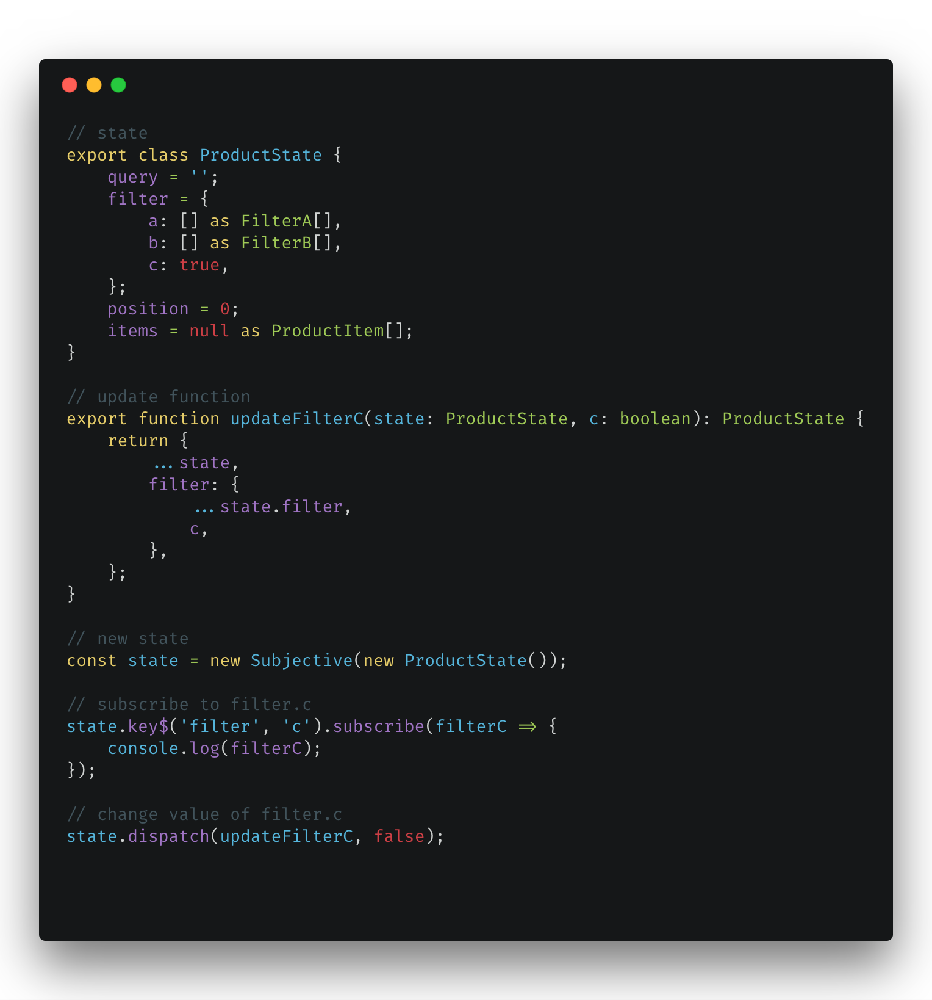

# Subjective

* Type safety dispatcher and observable state
* Favors simple functions and immutable pattern for updating the state
* State as a class (optional, but recommended)
* Subscribe to a particular key of the state (can be one level nested), return value of the key or the whole state

## Usage

* Observable Service in Angular
* Observable Store

## Examples

* [Angular](https://stackblitz.com/edit/subjective?file=app%2Fcore%2Fstores%2Fproduct%2Fproduct.state.ts)
* [Tests](test/subjective.test.ts)

## Credits

* ngrx
* redux
