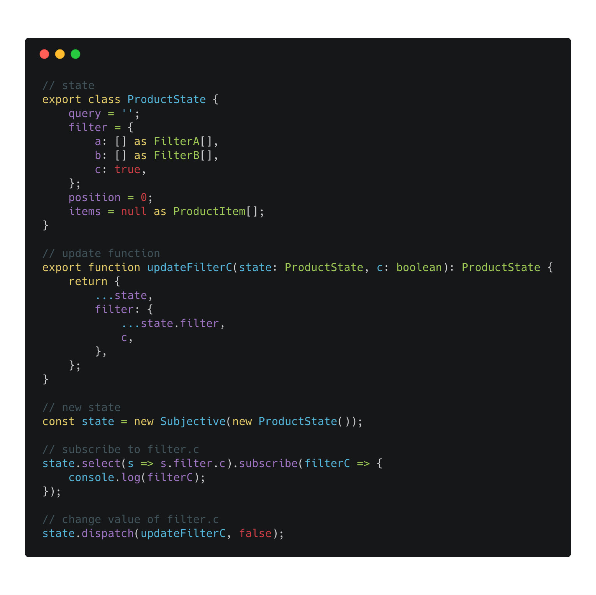

# Subjective

*   Type safety dispatcher and observable state
*   Favors simple functions and immutable pattern for updating the state
*   State as a class (optional, but recommended)
*   Subscribe to a particular key of the state defined by mapFn in select method, return value of the key or the whole state

## Usage

*   Observable Service in Angular
*   Observable Store

## Examples

*   [Angular](https://stackblitz.com/edit/subjective?file=app%2Fcore%2Fstores%2Fproduct%2Fproduct.state.ts)
*   [Tests](test/subjective.test.ts)



## Observable Service in Angular

### Service & State

Service is @Injectable and contains a reference to the state and async methods (for communication with backend).
The state is instantiated as state property in Angular Service, but the whole state is defined in xy.state.ts file together with update functions.

*   core
    *   stores
        *   cart
            *   cart.service.ts
            *   cart.state.ts
        *   product
            *   product.service.ts
            *   product.state.ts

### Dispatch Update function

Dispatch update function defined in product.state.ts optionally with a payload.
Payload type is inferred from the update function.

```typescript
@Component({})
export class ProductDetailComponent {

  constructor(private _productService: ProductService) { }

  addLike(item: ProductItem) {
    this._productService.state.dispatch(
      addLike,
      item
    );
  }

}
```

### Dispatch Update function & return Last state

Sometimes it's handy to have a snapshot of last updated state.
Dispatch method returns a snapshot of last updated state.

```typescript
@Component({})
export class FilterTypeComponent {
  @Output() search = new EventEmitter<Filter>();

  constructor(private _productService: ProductService) { }

  filter(type: FilterType) {
    // set filter.type
    const lastUpdatedState = this._productService.state.dispatch(
      replaceFilterType,
      type
    );
    // search by whole filter
    // {filter: {type: string, price: number}}
    this.search.emit(
      lastUpdatedState.filter
    );
  }
}
```

### Subscribe to a state

Subscribe to a particular key of the state defined by mapFn in select method and return value of the key.

```typescript
@Component({})
export class FilterTypeComponent implements OnInit, OnDestroy {
  private _onDestroy$ = new Subject();

  constructor(private _productService: ProductService) { }

  ngOnInit() {
      // {filter: {type: string, price: number}}
      this._productService.state.select(s => s.filter.type)
        .pipe(takeUntil(this._onDestroy$))
        .subscribe(type => {
          // DO WHATEVER
      })
  }

  ngOnDestroy() {
    this._onDestroy$.next();
  }
}
```

### Subscribe to a state & return whole state

Sometimes you need to react to changes of a particular key of the state and get the whole state.
By using the second argument in the select method, you can get the whole state in subscribe callback.

```typescript
@Component({})
export class FilterTypeComponent implements OnInit, OnDestroy {
  private _onDestroy$ = new Subject();

  constructor(private _productService: ProductService) { }

  ngOnInit() {
      // {filter: {type: string, price: number}}
      this._productService.state.select(s => s.filter.type, true)
        .pipe(takeUntil(this._onDestroy$))
        .subscribe(state => {
          // DO WHATEVER WITH WHOLE STATE
      })
  }

  ngOnDestroy() {
    this._onDestroy$.next();
  }
}
```

### Snapshot

Get a snapshot of the last changed state. You can't be subscribed to it.
Should be used rarely.

### Initial State

Get the initial state of the state. It's handy when you need to reset particular part of the state.

### Immutable pattern

Always use immutable pattern otherwise it will not work. With mutations, we cannot simply compare what's been changed, object reference is always the same.

### Type-safety

Types are always inferred either from state class or payload parameter of the update function.

## Credits

*   ngrx
*   redux
